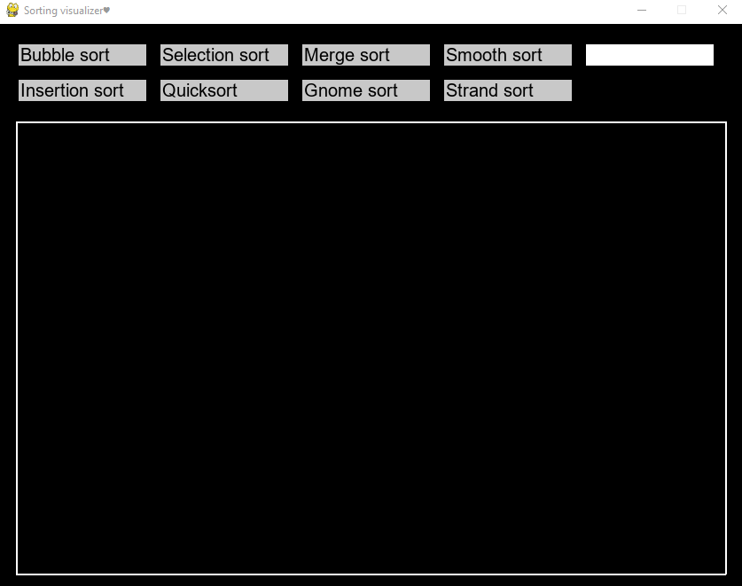
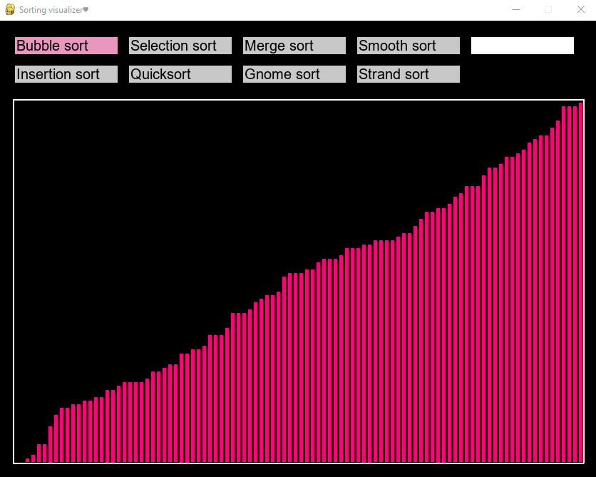
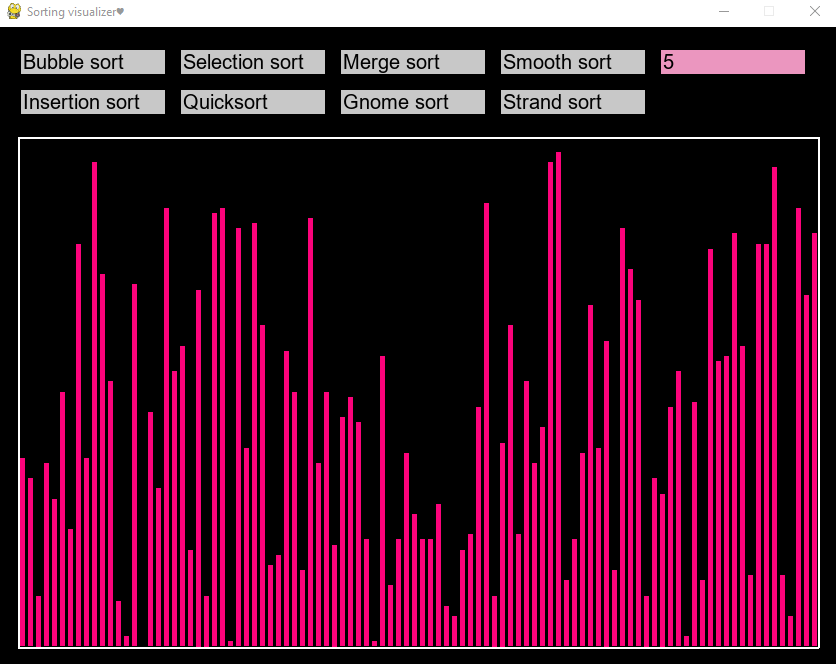
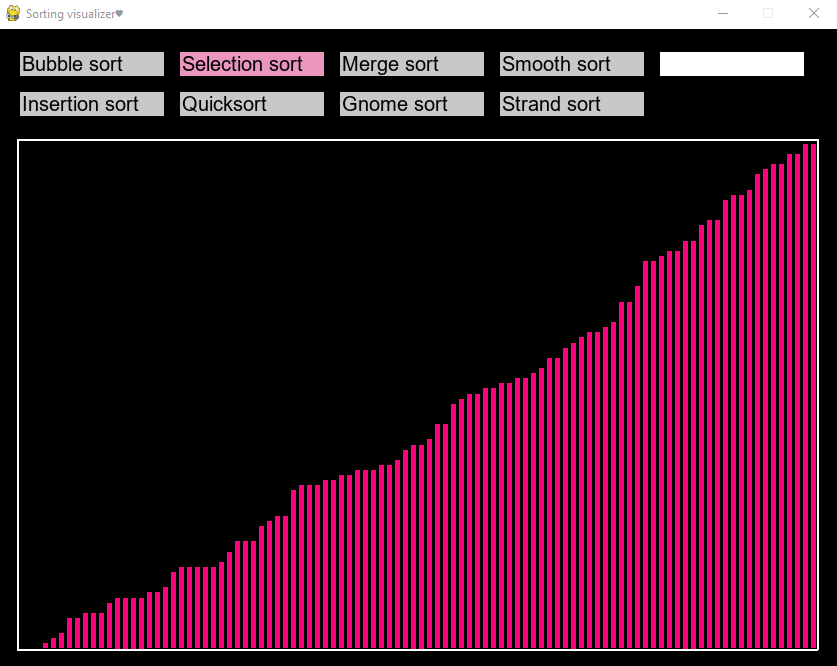

# Sorting algorithm visualizer

In order to start visualizing an algorithm you just need to select one, the default delay between chages is one ms but you can change it by selecting the with cell and writing the new delay, to confirm it just press return on the keyboard 

